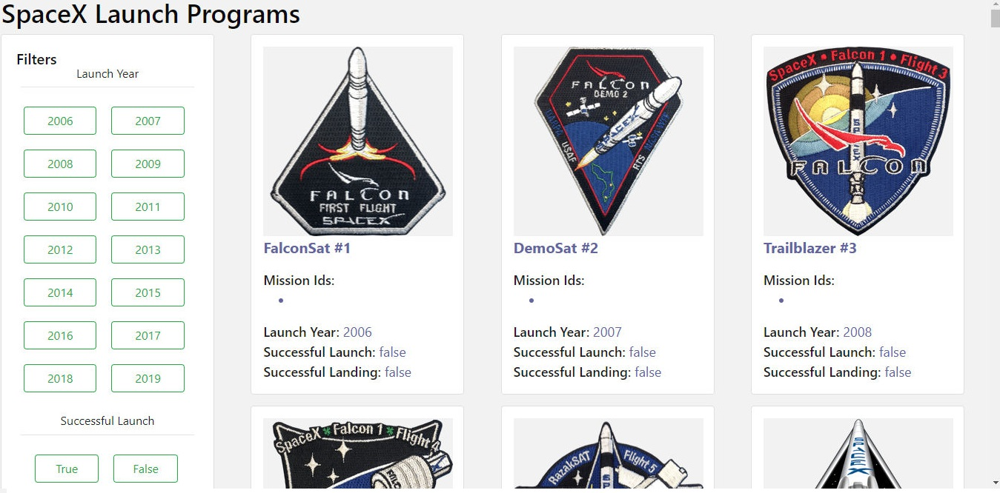

# Spacex

A front-end application which would help users list and browse all launches by SpaceX program.
 
## Installation
To install, simply clone this repository & run the following command  `yarn` or `npm install`, this will install all the dependencies for you.

## Running Project
To run this project locally, run the following command  `yarn start` or `npm start`, this will start a local instance of the application & you will be able to run the app in your browser at this url http://localhost:3000/.

## UI And Filter Implementation

>Filters and Launch Items details cards having Spacex launch details fetched from API

> After Applying Launch Year Filter

> After Applying Successful Launch Filter

> After Applying Launch Year, Successful Launch and Landing Success Filter

Developed By [Anu Gupta](https://github.com/anugupta01/spacex)
